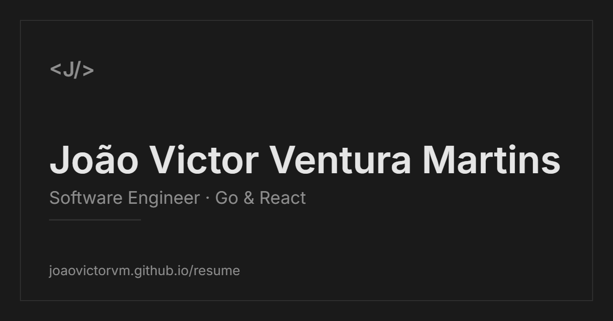

# Personal Portfolio — João Victor Ventura Martins

<p align="center">
  
</p>

<p align="center">
  A minimalist, editorial, bilingual (PT/EN) portfolio built as a fully static,
  SEO-first site.
</p>

<p align="center">
  <a href="https://joaovictorvm.github.io/"><strong>Live site »</strong></a>
</p>

<p align="center">
  
  
  
  
  
</p>

---

## About

A rewrite of my personal portfolio, moving from Next.js to a modern
React 19 + Vite + TanStack Start stack, prerendered to static HTML for real
per-route SEO. The design is intentionally minimal: a single narrow editorial
column, dark-first, monochromatic, with subtle CSS-only motion.

## Features

- **Bilingual (PT/EN)** — central, fully typed dictionary; the type system
  guarantees both languages stay in sync.
- **Dark / light theme** — persisted across visits, no flash on load.
- **Static Site Generation** — every route is prerendered to its own HTML, so
  crawlers get real content and metadata.
- **SEO-first** — per-route `<title>`, description, Open Graph / Twitter cards,
  canonical URLs, JSON-LD, `sitemap.xml`, `robots.txt` and a 1200×630 OG image.
- **Accessibility** — semantic HTML, keyboard navigation, visible focus, correct
  heading order, ARIA on interactive widgets, and AA color contrast.
- **CSS-only animations** — reveal-on-scroll, typing effect and staggered
  cascades, all respecting `prefers-reduced-motion`.
- **Zero arbitrary values** — every color, spacing and size comes from design
  tokens exposed as Tailwind utilities.

## Tech stack

| Area            | Choice                                             |
| --------------- | -------------------------------------------------- |
| Framework       | React 19 + TypeScript (strict)                     |
| Build / bundler | Vite                                               |
| Routing / SSG   | TanStack Router + TanStack Start (prerender)       |
| Styling         | Tailwind CSS v4 (CSS-first, token-based)           |
| Accessibility   | Radix Primitives (accordion) + hand-built UI       |
| Icons / font    | lucide-react · self-hosted Inter                   |
| Tooling         | pnpm · ESLint · Prettier · Husky + lint-staged     |

## Getting started

**Prerequisites:** [Node.js](https://nodejs.org) 20+ and [pnpm](https://pnpm.io).

```bash
pnpm install     # install dependencies
pnpm dev         # start the dev server
pnpm build       # static production build (SSG/prerender)
pnpm preview     # serve the production build locally
pnpm lint        # ESLint
pnpm format      # Prettier
```

## Project structure

```
src/
├─ routes/        # TanStack Router routes (/, /projects, /certificates, /gamedev, /links, 404)
├─ features/      # self-contained features (home, projects, certificates, games, links)
├─ components/    # shared UI + layout (Header, Footer, Accordion, switchers…)
├─ shared/        # hooks, i18n dictionary, design tokens, styles, utils
├─ context/       # theme + language provider
└─ types/         # shared type definitions
```

## Deployment

Deployed to **GitHub Pages** as a user site at the root domain. A GitHub Actions
workflow builds the site and publishes `dist/client` on every push to `main`.

The base path is configured via Vite (`base: "/"`) and resolved throughout with
`import.meta.env.BASE_URL`, so the repository must be named
`joaovictorvm.github.io` with Pages set to the **GitHub Actions** source.

## Contact

- **Website** — [joaovictorvm.github.io](https://joaovictorvm.github.io/)
- **LinkedIn** — [in/jvvmartins](https://www.linkedin.com/in/jvvmartins/)
- **GitHub** — [@JoaoVictorVM](https://github.com/JoaoVictorVM)
- **Email** — jvmartinscv@gmail.com

---

<p align="center"><sub>© 2026 João Victor Ventura Martins</sub></p>
